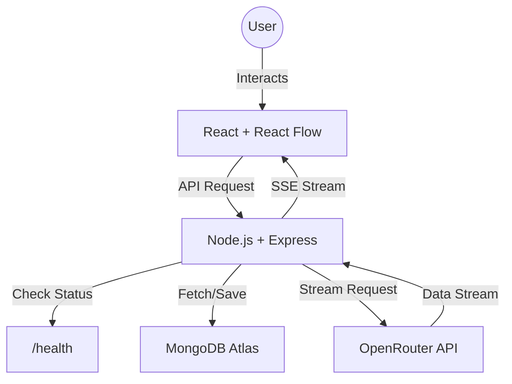

# FutureBlink — Build AI Workflows on a Visual Canvas

FutureBlink is a simple tool that lets you build and run AI workflows on a visual map. Instead of just chatting with an AI in a single box, you can drag and drop nodes, connect them, and watch the AI stream responses directly onto your canvas.

---

## 🌐 Live Demo

- **Frontend (Vercel)**: [future-blink-ai-chat.vercel.app](https://future-blink-ai-chat.vercel.app)
- **Backend (Render)**: [futureblink-ai-chat.onrender.com](https://futureblink-ai-chat.onrender.com)

---

## ✨ What makes FutureBlink special?

### 🎨 Visual Flow Builder

We use **React Flow** to give you a semi-infinite canvas. You aren't stuck in a list of messages. You can move your ideas around, connect different prompts, and organize your thoughts visually.

- **Custom Nodes**: We've built custom "Input" and "Result" nodes that handle everything from text entry to Markdown rendering.
- **Save to History**: Quickly save your favorite prompts and AI responses to the database for later.
- **Responsive Design**: Whether you're on a massive monitor or a phone, the canvas adjusts so you can keep working.

### 🤖 Real-Time AI Streaming

Waiting for a long AI response can be boring. FutureBlink streams the response character-by-character, so you can start reading immediately.

- **Powered by OpenRouter**: This means you can use almost any AI model (like Gemma, Mistral, or Llama) just by changing a single line in your settings.
- **Markdown Support**: AI responses aren't just plain text. They support bolding, lists, code blocks, and more, thanks to our integrated Markdown renderer.

### 🛠️ Professional Backend (Simple & Secure)

The backend is built with Node.js and Express, using TypeScript to make sure everything stays bug-free.

- **Database**: We use MongoDB to store your "sessions" (prompts and responses).
- **Keep-Alive**: Built-in logic to make sure Render's free tier doesn't put your app to sleep.
- **Global Safety**: A centralized error handler ensures that if something goes wrong, you get a clear message instead of a generic crash.

---

## 🏗️ How it's built (The Architecture)



---

## 🛠️ The Tech Stack

| Component       | Technology      | Why we chose it                                           |
| :-------------- | :-------------- | :-------------------------------------------------------- |
| **Frontend**    | React 19 + Vite | Fast, modern, and great for building complex UIs.         |
| **Flow Engine** | React Flow      | The best library for building node-based editors.         |
| **Styling**     | TailwindCSS     | Makes the app look "premium" with very little custom CSS. |
| **Backend**     | Express + TS    | Reliable, fast, and type-safe.                            |
| **Database**    | MongoDB         | Flexible enough to store varying AI responses.            |
| **AI Hub**      | OpenRouter      | One API for every AI model under the sun.                 |

---

## 🚀 Getting it running on your machine

### 1. Prerequisites

Make sure you have **Node.js** installed. You'll also need a **MongoDB** connection string (Atlas is great for this) and an **OpenRouter API Key**.

### 2. Installation

First, grab the code:

```bash
git clone https://github.com/Puneet28j/FutureBlink-AI-Chat.git
cd FutureBlink
```

Install the dependencies for both parts:

```bash
# Install Backend stuff
cd Backend && npm install

# Install Frontend stuff
cd ../Frontend && npm install
```

### 3. Set up your Environment Variables

In the `Backend/` folder, create a file named `.env` and fill it in:

```env
PORT=5000
MONGODB_URI=your_mongodb_connection_string
OPENROUTER_API_KEY=your_openrouter_key

# Optional: What AI model should we use?
OPENROUTER_MODEL=google/gemma-2-9b-it:free

# Required for Deployment
FRONTEND_URL=http://localhost:5173
RENDER_EXTERNAL_URL=http://localhost:5000
```

### 4. Let's go!

Run these in separate terminals:

```bash
# Start the Backend
cd Backend && npm run dev

# Start the Frontend
cd ../Frontend && npm run dev
```

Now visit `http://localhost:5173` and start building!

---

## ☁️ Deployment Instructions

### Backend (Render)

1. **Connect**: Link your GitHub repo to a new **Web Service** on Render.
2. **Build Command**: `npm install && npm run build`
3. **Start Command**: `npm start`
4. **Environment**: Add all the keys from your `.env` file to the Render dashboard.

### Frontend (Vercel)

1. **Connect**: Link your repo to Vercel.
2. **Framework**: It should detect "Vite" automatically.
3. **Variable**: Add `VITE_API_URL` and set it to your Render service URL (e.g., `https://my-backend.onrender.com`).
4. **Deployment**: Click deploy, and you're live!

---

## 🤝 Contributing

Found a bug? Have a cool feature request?

1. Fork the repo.
2. Create your feature branch (`git checkout -b feature/cool-feature`).
3. Commit your changes.
4. Push to the branch and open a Pull Request.

---

## 📄 License

FutureBlink is open-source and available under the **MIT License**.
